<div align="center">

<!-- 🌌 4K NEBULA COSMIC BANNER -->


<br><br>

<!-- ⚡ PREMIUM TYPING ANIMATION -->
<a href="https://git.io/typing-svg">

</a>

<br>

<!-- 🎯 SOCIAL BADGES -->
<p align="center">
<a href="https://github.com/goutamdhanani">

</a>
<a href="https://linkedin.com/in/goutam-dhanani">

</a>
<a href="https://goutamdhanani.netlify.app/">

</a>
<a href="https://leetcode.com/goutamdhanani">

</a>
<a href="mailto:goutamdhanai@gmail.com">

</a>
</p>

<br>

<!-- 📊 PROFILE INFO -->
<table border="0" align="center">
<tr>
<td align="center" width="100%">

### **GOUTAM KUMAR**
#### Software Engineer | DevOps Specialist | Cloud Infrastructure Engineer

<br>

📍 **Bangalore, Karnataka, India** • 📧 **goutamdhanai@gmail.com** • 📱 **+91 902-437-8271**

<br>


</td>
</tr>
</table>

</div>

<br>

<!-- 🌟 NEBULA DIVIDER -->


<br><br>

## 🌌 ABOUT ME

<div align="center">

```yaml
profile:
  name: "Goutam Kumar"
  title: "Software Engineer & DevOps Specialist"
  location: "Bangalore, Karnataka, India"
  contact:
    email: "goutamdhanai@gmail.com"
    phone: "+91 902-437-8271"
    portfolio: "https://goutamdhanani.netlify.app/"
    linkedin: "https://linkedin.com/in/goutam-dhanani"
    github: "https://github.com/goutamdhanani"
    leetcode: "https://leetcode.com/goutamdhanani"
  
education:
  degree: "Bachelor of Computer Applications"
  institution: "Jain College"
  cgpa: 8.62
  duration: "October 2021 - August 2024"
  
  previous:
    level: "Senior Secondary (12th Grade)"
    school: "Government SN Sec School"
    stream: "Arts"
    percentage: 84
    duration: "2018 - 2020"

professional_summary: |
  Detail-oriented Software Engineer with a Bachelor's degree in Computer 
  Applications and hands-on experience in developing and maintaining software 
  applications. Proficient in Python programming with strong analytical 
  problem-solving abilities. Demonstrated experience collaborating with 
  cross-functional teams to deliver high-quality software solutions that meet 
  customer requirements. Skilled in troubleshooting complex issues, conducting 
  code reviews, and implementing best practices in software development 
  methodologies to ensure product excellence and reliability.

core_expertise:
  devops_cloud:
    - "AWS Cloud Services (EC2, S3, IAM)"
    - "Docker Containerization"
    - "Kubernetes Orchestration"
    - "CI/CD Pipeline Design (Jenkins, GitHub Actions)"
    - "GitOps Workflows"
    - "Linux System Administration"
    - "Infrastructure as Code"
    
  programming:
    - "Python (Flask, FastAPI)"
    - "JavaScript"
    - "Shell Scripting"
    - "SQL Databases"
    - "REST APIs"
    - "Git Version Control"
    
  software_engineering:
    - "Agile Methodology"
    - "Unit & Integration Testing"
    - "Test-Driven Development (TDD)"
    - "Microservices Architecture"
    - "System Design"
    - "Data Structures & Algorithms"
    - "Object-Oriented Design"
    - "SDLC Best Practices"
    
  soft_skills:
    - "Problem Solving"
    - "Communication"
    - "Team Collaboration"
    - "Adaptability"
    - "Critical Thinking"
    - "Time Management"
    - "Leadership"
    - "Technical Documentation"
    - "API Documentation"
    - "System Design Documentation"

certifications:
  - name: "IBM DevOps and Software Engineering Professional Certificate"
    issuer: "IBM"
    year: 2025
    skills: "CI/CD, Docker, Kubernetes, AWS, Agile"
    
  - name: "Developing AI Applications with Python and Flask"
    issuer: "IBM"
    year: 2025
    
  - name: "Blockchain Basics"
    issuer: "University at Buffalo"
    year: 2023

awards_recognition:
  - achievement: "3rd Place - Debugging Challenge"
    organization: "Jain University"
    year: 2023
    
  - achievement: "President - Computer Science Forum"
    organization: "Jain College"
    period: "2023-2024"
```

</div>

<br>

<!-- 🌟 NEBULA DIVIDER -->


<br><br>

## 💼 PROFESSIONAL EXPERIENCE

<br>

### 🏢 **Riddhi Siddhi** — Software Engineering Intern
**📅 January 2024 - May 2024** | **📍 Bangalore, India**

<div align="left">

**💫 Key Responsibilities:**

- ✨ Developed and maintained software components using modern programming practices
- 🤝 Collaborated with cross-functional teams to design and implement technical solutions
- 🐛 Conducted systematic debugging and troubleshooting to resolve software issues
- 👨‍💻 Participated in code reviews to ensure adherence to coding standards and best practices
- 🚀 Applied analytical problem-solving to overcome technical challenges and improve application performance

**🛠️ Technologies Used:**


</div>

<br>

### 🚀 **Independent Software Engineer** — Self-Learning & Project Development
**📅 November 2024 - July 2025**

<div align="left">

**🎓 Professional Development:**

- ✅ Completed **IBM DevOps and Software Engineering Professional Certificate**
  - Hands-on experience with CI/CD, Docker, Kubernetes, AWS, and Agile methodologies
- ✅ Continued **Data Structures & Algorithms** problem-solving on LeetCode
  - Strengthened algorithmic and problem-solving skills
- ✅ Built and maintained personal projects demonstrating full-stack capabilities

**💻 Technologies Mastered:**


</div>

<br>

<!-- 🌟 NEBULA DIVIDER -->


<br><br>

## 🎯 FEATURED PROJECTS

<br>

### 1️⃣ **Blockchain Time Capsule** — Full-Stack Blockchain Application

**📅 2025**

<div align="left">

**📋 Project Description:**

A full-stack blockchain-based time capsule system that allows users to store tamper-proof entries locked until a future date.

**🏗️ Key Features:**

- ✅ **SDLC Implementation:** Followed complete software development lifecycle from requirements gathering to deployment
- ✅ **Technical Architecture:** Designed and implemented RESTful APIs using Flask backend
- ✅ **DevOps Integration:** Containerized application using Docker for consistent development and deployment
- ✅ **Agile Practices:** Utilized Kanban board for task tracking and iterative development
- ✅ **Documentation:** Created comprehensive API documentation and system architecture diagrams

**💻 Technology Stack:**


</div>

<br>

### 2️⃣ **Self-Driving Car Simulation with Neural Network** — AI/ML Project

**📅 2024**

<div align="left">

**📋 Project Description:**

An AI-powered self-driving car simulation using neural networks and genetic algorithms.

**🏗️ Key Features:**

- ✅ **Development Process:** Built incremental features through iterative development cycles
- ✅ **Testing & Debugging:** Implemented comprehensive testing for neural network components
- ✅ **Technical Solutions:** Designed algorithm optimizations to improve simulation performance
- ✅ **Technologies:** JavaScript, Neural Networks, Genetic Algorithms

**💻 Technology Stack:**


</div>

<br>

### 3️⃣ **Ethereum NFT Marketplace** — Decentralized Application

**📅 2024**

<div align="left">

**📋 Project Description:**

A full-featured decentralized app (dApp) to mint, buy, and sell NFTs on the Ethereum blockchain.

**🏗️ Key Features:**

- ✅ Created a decentralized application (dApp) using Solidity, Web3.js, and React
- ✅ Implemented user authentication, smart contracts, and on-chain transactions
- ✅ Wrote clean, maintainable code following modular software design and microservices principles

**💻 Technology Stack:**


</div>

<br>

<!-- 🌟 NEBULA DIVIDER -->


<br><br>

## 🛠️ TECHNOLOGY STACK

<br>

### ☁️ **DevOps & Cloud**

<div align="center">


</div>

<br>

### 💻 **Programming & Tools**

<div align="center">


</div>

<br>

### 🗄️ **Databases**

<div align="center">


</div>

<br>

### ⛓️ **Blockchain & Web3**

<div align="center">


</div>

<br>

<!-- 🌟 NEBULA DIVIDER -->


<br><br>

## 📊 GITHUB STATISTICS

<div align="center">


<br><br>


</div>

<br>

<div align="center">


</div>

<br>

<!-- 🌟 NEBULA DIVIDER -->


<br><br>

## 🏆 CERTIFICATIONS & ACHIEVEMENTS

<div align="center">

### 🎓 **Professional Certifications**

<table>
<tr>
<td align="center" width="33%">
<br>
<strong>IBM DevOps and Software Engineering</strong><br>
<sub>2025</sub>
</td>
<td align="center" width="33%">
<br>
<strong>Developing AI Applications</strong><br>
<sub>2025</sub>
</td>
<td align="center" width="33%">
<br>
<strong>Blockchain Basics</strong><br>
<sub>2023</sub>
</td>
</tr>
</table>

<br>

### 🏅 **Awards & Recognition**

<table>
<tr>
<td align="center" width="50%">
<strong>🥉 3rd Place - Debugging Challenge</strong><br>
<sub>Jain University | 2023</sub>
</td>
<td align="center" width="50%">
<strong>👨‍💼 President - Computer Science Forum</strong><br>
<sub>Jain College | 2023-2024</sub>
</td>
</tr>
</table>

</div>

<br>

<!-- 🌟 NEBULA DIVIDER -->


<br><br>

## 🤝 LET'S CONNECT

<div align="center">

**💼 Open to DevOps Engineer & Cloud Infrastructure Opportunities**

<br>

📧 **goutamdhanai@gmail.com** • 📱 **+91 902-437-8271** • 📍 **Bangalore, India**

<br>

<a href="https://goutamdhanani.netlify.app/">

</a>
<a href="mailto:goutamdhanai@gmail.com">

</a>
<a href="https://linkedin.com/in/goutam-dhanani">

</a>

<br><br>

**⭐ If you like my work, consider starring my repositories!**

<br>

</div>

<!-- 🌟 FOOTER WAVE -->


<div align="center">

**Made with 💜 by Goutam Kumar**

*Last Updated: October 2025*

</div>
