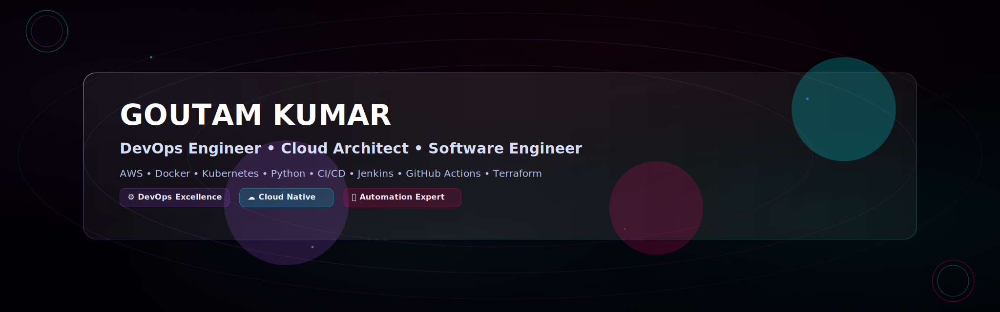

<div align="center">

<!-- 🌌 4K NEBULA COSMIC BANNER -->


<br><br>

<!-- ⚡ PREMIUM TYPING ANIMATION -->
<a href="https://git.io/typing-svg">

</a>

<br>

<!-- 🎯 SOCIAL BADGES -->
<p align="center">
<a href="https://github.com/goutamdhanani">

</a>
<a href="https://linkedin.com/in/goutam-dhanani">

</a>
<a href="https://goutamdhanani.netlify.app/">

</a>
<a href="mailto:goutamdhanai@gmail.com">

</a>
</p>

<br>

<!-- 📊 PROFILE INFO -->
<table border="0" align="center">
<tr>
<td align="center" width="100%">

### **GOUTAM KUMAR**
#### DevOps Engineer (Entry-Level) | Cloud & Kubernetes

📍 **Bangalore, India** • 📧 **goutamdhanai@gmail.com** • 📱 **+91 902-437-8271**


</td>
</tr>
</table>

</div>

<br>

<!-- 🌟 NEBULA DIVIDER -->


<br><br>

## 🌌 ABOUT ME

I build **production-style DevOps projects** on Kubernetes:
- **CI/CD pipelines** that ship automatically  
- **Kubernetes autoscaling (HPA)** under load  
- **Redis + workers** for durable async job processing  
- Clean routing using **Traefik Ingress**  
- Security checks with **Trivy scanning**

<br>

<!-- 🌟 NEBULA DIVIDER -->


<br><br>

## 🚀 FEATURED DEVOPS PROJECTS

### ✅ Job Queue Worker System (Redis + FastAPI + Kubernetes + HPA)
A Redis-backed job processing system built to showcase Kubernetes scaling + failure recovery.

**What it proves**
- Durable queue processing (no silent drops)
- Stateless API + autoscaled worker deployments
- Redis StatefulSet + PVC (stateful workload)
- HPA scaling under real CPU load
- Requeue + stuck job recovery patterns

**Kubernetes demo commands**
```bash
kubectl -n job-system get pods
kubectl -n job-system get hpa
kubectl top pods -n job-system
watch -n 2 "kubectl -n job-system get hpa; echo '---'; kubectl -n job-system get pods -l app=worker"
````

---

### ☕ CoffeeOps (k3s + CI/CD + Trivy + Traefik)

A small app with a real DevOps pipeline: **build → scan → ship → run**.

**Live**

* Frontend: [http://64.227.133.210/](http://64.227.133.210/)
* API: [http://64.227.133.210/api/menu](http://64.227.133.210/api/menu)

**CI/CD flow**

* GitHub Actions builds Docker images
* Trivy scans for HIGH/CRITICAL vulnerabilities
* Pushes to DockerHub
* Deploys to k3s server + rollout restart

**Proof**

```bash
curl -s http://64.227.133.210/api/health
curl -s http://64.227.133.210/api/menu
curl -s http://64.227.133.210/api/version
```

<br>

<!-- 🌟 NEBULA DIVIDER -->


<br><br>

## 🛠️ TECH STACK

**DevOps & Cloud:** Kubernetes (k3s), Docker, GitHub Actions, CI/CD, AWS (EC2, S3, IAM), Linux
**Kubernetes:** HPA, Ingress (Traefik), StatefulSet, PVC, metrics-server
**Backend:** FastAPI, Flask, REST APIs
**Security:** Trivy scanning, Kubernetes Secrets
**Scripting:** Python, Shell

<br>

<!-- 🌟 NEBULA DIVIDER -->


<br><br>

## 📊 STATS

<div align="center">


</div>

<br>

<!-- 🌟 NEBULA DIVIDER -->


<br><br>

## 🤝 CONNECT

📧 [goutamdhanai@gmail.com](mailto:goutamdhanai@gmail.com)
💼 [https://linkedin.com/in/goutam-dhanani](https://linkedin.com/in/goutam-dhanani)
🌐 [https://goutamdhanani.netlify.app/](https://goutamdhanani.netlify.app/)


```
